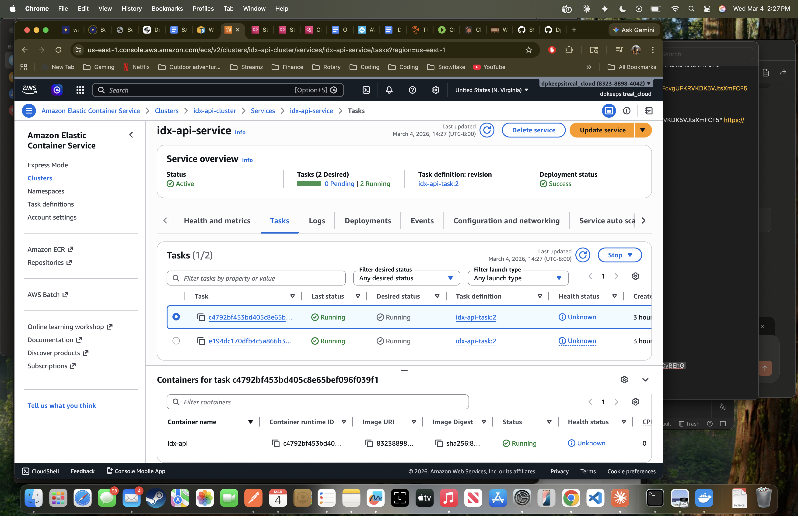
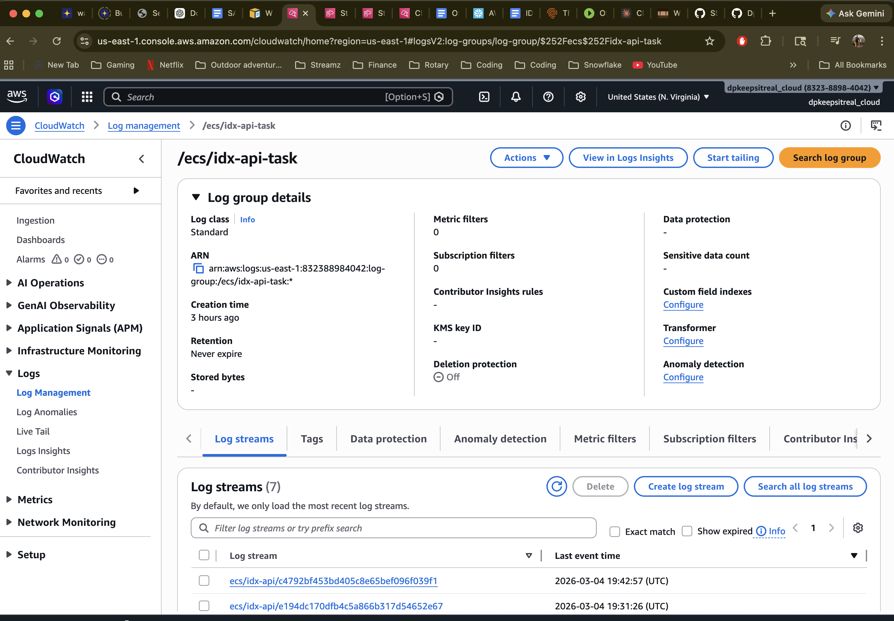
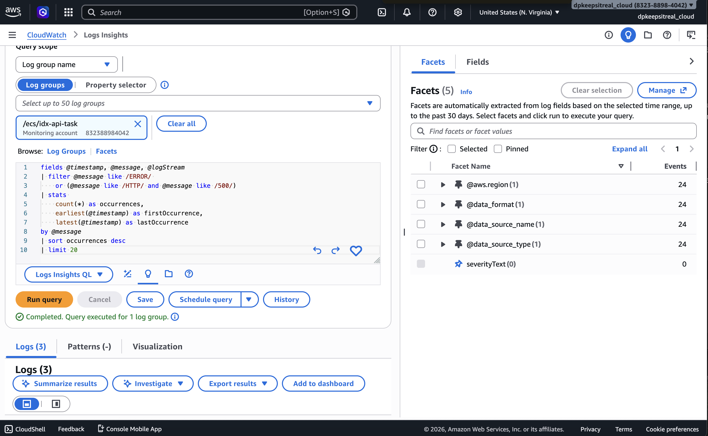
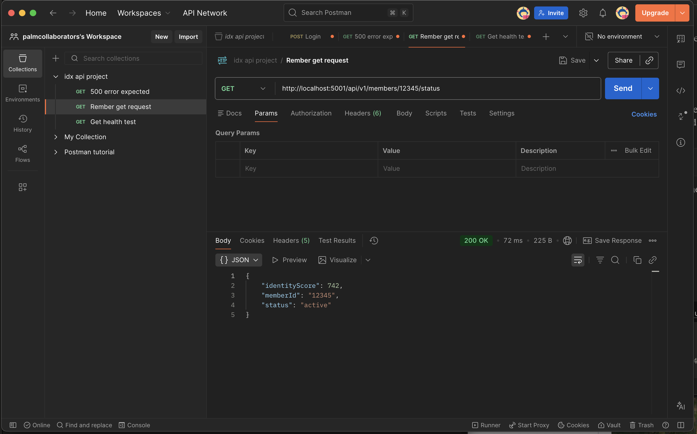

# api-ecs-project
Flask microservice deployed to AWS ECS Fargate with CloudWatch monitoring

# Microservices API — AWS ECS Fargate + CloudWatch Monitoring

A production-style REST API microservice built to mirror real-world 
cloud infrastructure used by identity verification platforms.
Containerized with Docker and deployed to AWS ECS Fargate with live 
CloudWatch monitoring, log investigation, and a metrics dashboard.

---

## Architecture

```
Postman/Browser → ECS Fargate (2 running tasks) → CloudWatch Logs
                          ↑
                   ECR (Docker image registry)
```

## Tech Stack

| Layer | Technology |
|-------|-----------|
| Language | Python 3.11 / Flask |
| Containerization | Docker (linux/amd64) |
| Container Registry | AWS ECR |
| Compute | AWS ECS Fargate (serverless) |
| Monitoring | AWS CloudWatch Logs + Dashboards |
| API Testing | Postman |

---

## API Endpoints

| Method | Endpoint | Status | Description |
|--------|----------|--------|-------------|
| GET | `/health` | 200 | Health check — mirrors ALB target group probe |
| GET | `/api/v1/members/{id}/status` | 200 | Member status lookup — happy path |
| GET | `/api/v1/members/error_test/status` | 500 | Simulated error — triggers CloudWatch ERROR logs |

---

## What I Built

### Docker & ECR
- Built Flask API containerized for `linux/amd64` (Fargate compatible)
- Resolved Apple Silicon ARM → Fargate amd64 architecture mismatch
  using `--platform linux/amd64` build flag
- Pushed image to AWS Elastic Container Registry

### ECS Fargate Deployment
- Created ECS cluster, task definition (0.25 vCPU / 0.5GB), and service
- Deployed 2 running tasks across multiple availability zones
- Configured security group with inbound rule on port 5000
- Observed multiple log streams confirming multi-container distribution

### CloudWatch Monitoring
- Log group `/ecs/idx-api-task` with individual per-container log streams
- Identified two distinct log sources per request:
  - `werkzeug` — HTTP layer logging every transaction
  - `app` — application business logic logging
- Built 5-widget CloudWatch dashboard tracking error rate, request 
  volume, success vs error comparison, container health, recent errors
- Wrote Log Insights queries for full incident investigation workflow

---

## CloudWatch Log Insights Queries

**Find all errors across all containers:**
```
fields @timestamp, @message, @logStream
| filter @message like /ERROR/
| sort @timestamp desc
| limit 20
```

**Error volume over time:**
```
fields @timestamp, @message
| filter @message like /ERROR/
| stats count(*) as errorCount by bin(5m)
| sort @timestamp asc
```

**Success vs error rate:**
```
fields @timestamp, @message
| filter @message like /HTTP/
| stats
    sum(@message like /" 200/) as successes,
    sum(@message like /" 500/) as errors
by bin(5m)
| sort @timestamp asc
```

**Trace a specific member across all containers:**
```
fields @timestamp, @message, @logStream
| filter @message like /member_8842/
| sort @timestamp asc
```

**Container health comparison:**
```
fields @timestamp, @message, @logStream
| stats
    count(*) as totalRequests,
    sum(@message like /ERROR/) as errors
by @logStream
| sort errors desc
```

**Full incident investigation query:**
```
fields @timestamp, @message, @logStream
| filter @message like /ERROR/
    or (@message like /HTTP/ and @message like /" 500/)
| stats
    count(*) as occurrences,
    earliest(@timestamp) as firstOccurrence,
    latest(@timestamp) as lastOccurrence
by @message
| sort occurrences desc
| limit 20
```

---

## Key Learnings

- **Architecture mismatch:** Mac M-chip builds ARM images by default.
  ECS Fargate requires `--platform linux/amd64` flag at build time
- **Log levels:** `INFO` = normal operations narrated by the app.
  `ERROR` = failure caught by application code. Both needed for
  full incident investigation
- **Multiple log streams:** Each ECS task creates its own log stream.
  Errors on all streams = deployment/config issue.
  Errors on one stream = isolated container problem
- **Security groups:** Port 5000 must be explicitly opened in inbound
  rules — default security group blocks all custom ports
- **SSH authentication:** Multiple GitHub accounts require separate
  SSH keys and a custom `~/.ssh/config` host alias per account

---

## Local Development

```bash
# Build for Fargate compatibility
docker build --platform linux/amd64 -t idx-api:v1 .

# Run locally
docker run -d -p 5001:5000 idx-api:v1

# Test all endpoints
curl http://localhost:5001/health
curl http://localhost:5001/api/v1/members/12345/status
curl http://localhost:5001/api/v1/members/error_test/status
```

---

## Screenshots

### ECS Tasks Running


### CloudWatch Log Streams


### CloudWatch Dashboard


### Postman API Responses


---

*Built as part of AWS Solutions Architect Associate (SAA-C03) 
certification preparation — hands-on project mirroring 
real production infrastructure patterns.*
````

Once you paste that in and commit it, upload your screenshots to `docs/screenshots/` using the **Add file** button on GitHub and the images will render inline in the README automatically.
